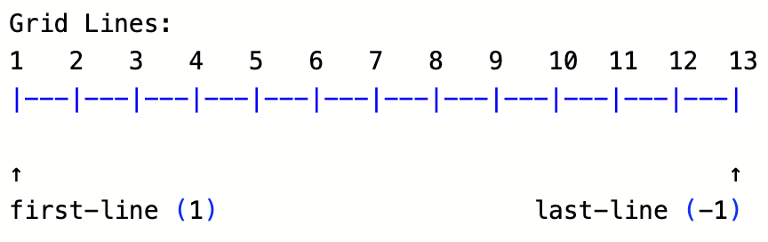

## 🧾 Responsive Grid-Based Form Layout (with CSS Grid)

This project demonstrates a clean, responsive form layout built using **HTML5 + CSS Grid**, styled with the [h8k-design](https://www.jsdelivr.com/package/npm/h8k-design) design system via CDN.

## Grid Layout Visualization

This is example for grid template column 12

